# Quaestor

[](https://github.com/Emperiusm/quaestor/actions/workflows/ci.yml)
[](LICENSE.md)


<picture>
  <source media="(prefers-color-scheme: dark)" srcset="docs/assets/hero-dark.svg">
  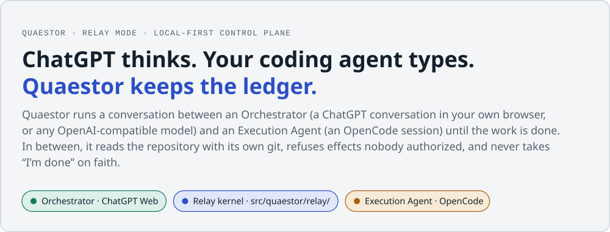
</picture>

**Quaestor is a local-first, model-agnostic control plane for AI engineering work.** A strategic
model directs a coding agent working in your repository, and Quaestor moves every turn between
them automatically. It keeps message identity across crashes, checks the repository with its own
`git` rather than trusting the agent's account, and stops at the owner boundary.

> [!NOTE]
> **What ships today is local**: a CLI, an MCP server and a loopback console, installed from a
> checkout. Nothing is `PRODUCT_SUPPORTED` yet. The hosted **Quaestor Web** (PRD §13) and
> **Quaestor Cloud** (PRD §49) are product contract, not code. See [Status](#status).

<table>
<tr>
<td valign="top" width="33%">

**Get going**
- [Install](#install)
- [Quick start: Relay Mode](#quick-start-relay-mode)
- [Quick start: Program Mode](#quick-start-program-mode)

</td>
<td valign="top" width="33%">

**How it works**
- [The map](#the-map)
- [How Quaestor connects to ChatGPT](#how-quaestor-connects-to-chatgpt)
- [One relay exchange](#one-relay-exchange-start-to-finish)
- [Reading a chat page reliably](#reading-a-chat-page-reliably)

</td>
<td valign="top" width="33%">

**Why you can trust it**
- [Governance](#governance-gate-the-act-not-the-sentence)
- ["Done" is measured](#done-is-a-claim-and-it-gets-measured)
- [Crash recovery](#surviving-a-crash-mid-turn)
- [Status and evidence](#status) · [Limits](#security-and-known-limits)

</td>
</tr>
</table>

## The map

<picture>
  <source media="(prefers-color-scheme: dark)" srcset="docs/assets/relay-topology-dark.svg">
  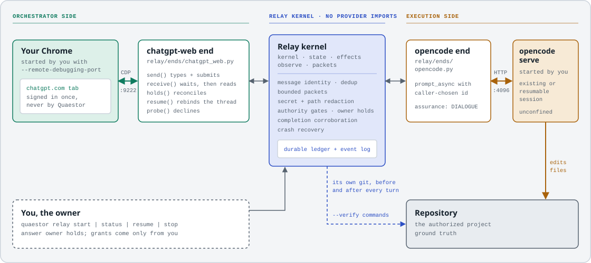
</picture>

Solid arrows carry messages. The **dashed cobalt line is the kernel reading the repository
itself**. The agent's own `/vcs/status` and diff endpoints are deliberately not used, because a
report from the party it describes doesn't count as evidence.

The kernel imports no provider. It reaches both ends by name through
[`relay/registry.py`](src/quaestor/relay/registry.py), and a control walks the import graph to
prove that `kernel.py`, `state.py`, `effects.py`, `observe.py` and `packets.py` never import
anything from `relay/ends/`.

## Why it exists

Handing an objective to a capable agent is easy. The hard part is knowing afterwards **what
actually happened**, and being able to stop it, resume it or refuse it. Quaestor is the part that
refuses.

| Principle | What it means in practice |
|---|---|
| **The executor proposes; an authorized principal grants** | An executor can ask for more access. It can never give itself any. |
| **No layer grades its own homework** | The executor's report is a claim, and so is the reviewer's. Ground truth is deterministic measurement (exit codes, git state, test results, file hashes), collected by something with no stake in the answer. |
| **At most one active execution per dispatch identity** | Reconciliation is durable, and an ambiguous write is never blindly retried. This is deliberately *not* exactly-once, which is unprovable across arbitrary crashes. |
| **Waiting is not failure** | A relay or lane that asked a question and stopped has behaved correctly, and Quaestor reports it that way. |

<details>
<summary><b>Vocabulary</b></summary>

| Term | Meaning |
|---|---|
| **Orchestrator** | Owns strategy: a human, or a strategic model reached through an admitted provider. Relay-qualified today: `chatgpt-web`, `openai-chat`. |
| **Execution Agent** | Performs the implementation work in a repository. Relay-qualified today: `opencode`. |
| **Relay kernel** | The provider-neutral middle of Relay Mode ([`src/quaestor/relay/`](src/quaestor/relay/)). It holds message identity, delivery, gates, observation and recovery. |
| **Quaestor Core** | The local runtime and authenticated local service boundary (`quaestor serve`). Client tokens are scoped to named projects; the API has five named operations and no shell, file or path parameter. See [`docs/OPERATIONS.md`](docs/OPERATIONS.md) §12. |
| **Owner authority** | The human-only ceiling. A profile grants capabilities; an owner-gated capability also needs a live, unexpired, unrevoked owner grant in the durable store. No model, prompt, transport or provider can mint one ([`core/authority.py`](src/quaestor/core/authority.py)). |
| **Work**, **Quaestor Web**, **Quaestor Cloud** | Product contract (PRD §17–§23, §13, §49). Not implemented at HEAD. |

**The name.** A quaestor was a Roman official who audited the public accounts and controlled
disbursement. The name describes the role and is provisional: every default that mentions the
product reads from [`src/quaestor/branding.py`](src/quaestor/branding.py), and a control asserts
that no other module hard-codes it.

</details>

## Install

| You need | For |
|---|---|
| **Python 3.11+** and `git` on `PATH` | Everything. There are **no runtime dependencies**: the package is standard-library only, so installing it can't hit a resolver conflict inside someone else's repository. |
| [`opencode`](https://opencode.ai) (`opencode serve`) | Relay Mode's Execution Agent |
| An OpenAI-compatible API key, **or** a Chrome/Chromium you can start with a debug port | Relay Mode's Orchestrator (`openai-chat` or `chatgpt-web`) |
| The Claude Code CLI (`claude`) | Program Mode's real executor |
| `cloudflared` or any HTTPS tunnel | The ChatGPT MCP connector |
| *Optional:* `pip install -e ".[browser]"` | Playwright's waiting primitives. The default browser transport is a stdlib-only CDP client. |

```bash
git clone https://github.com/Emperiusm/quaestor.git && cd quaestor
pip install -e .             # installs the `quaestor` command
python run_tests.py          # the gate: exits 0 only on PASS
python check_static.py       # syntax, unused imports, and the project's own invariants
```

To run without installing, use `python bin/quaestor ...` (POSIX) or `bin\quaestor.cmd` (Windows).
Both put `src/` on the path themselves.

## Quick start: Relay Mode

Relay Mode needs an agent server that **you** start. Quaestor attaches to it and never owns its
lifetime.

```bash
# 1. In the project, in its own terminal: the agent server you own.
opencode serve --port 4096

# 2. Check that a relay could actually run right now. Every line is measured, not assumed.
quaestor relay doctor --project . \
  --orchestrator openai-chat \
    --orchestrator-base-url https://openrouter.ai/api/v1 \
    --orchestrator-model anthropic/claude-sonnet-5 \
    --orchestrator-key-var OPENROUTER_API_KEY \
  --agent opencode --agent-base-url http://127.0.0.1:4096 \
    --agent-model anthropic/claude-sonnet-5

# 3. Start it, with checks the relay runs itself before believing "done".
quaestor relay start --project . \
  --objective "The migration test fails on Postgres 16. Diagnose it, fix it, and prove it." \
  --orchestrator openai-chat \
    --orchestrator-base-url https://openrouter.ai/api/v1 \
    --orchestrator-model anthropic/claude-sonnet-5 \
    --orchestrator-key-var OPENROUTER_API_KEY \
  --agent opencode --agent-base-url http://127.0.0.1:4096 \
    --agent-model anthropic/claude-sonnet-5 \
  --verify "python -m unittest discover" --require-repo-change

# 4. From anywhere, at any time.
quaestor relay status --transcript
quaestor relay resume        # after a crash, a kill, or a machine restart
quaestor relay stop          # marks it stopped in the durable record
```

### With ChatGPT as the Orchestrator

```bash
# Start a browser Quaestor can attach to, and sign in ONCE in that window.
# Quaestor never launches it, never sees the password, and never closes it.
chrome.exe --remote-debugging-port=9222 --user-data-dir="%LOCALAPPDATA%\Chrome-Quaestor"

quaestor relay start --project . --objective "..." \
  --orchestrator chatgpt-web --browser-endpoint http://127.0.0.1:9222 \
  --agent opencode --agent-base-url http://127.0.0.1:4096 \
  --agent-model <provider>/<model> \
  --verify "python -m unittest discover"
```

> [!WARNING]
> **The debug port is a standing key to that browser.** Any local process that can reach `:9222`
> can drive every tab and cookie in the profile as you. Use a `--user-data-dir` kept for this
> purpose only, start it when you need the relay, and close it afterwards.

<details>
<summary><b>Flags worth knowing</b></summary>

| Flag | Default | What it does |
|---|---|---|
| `--conversation-id <uuid>` | new thread | Bind an existing ChatGPT thread. When omitted, the new thread's id is recorded for `resume`. |
| `--browser-transport auto\|cdp\|playwright` | `auto` | `auto` takes Playwright when it's importable and can attach, and falls back to stdlib CDP otherwise. |
| `--session-id ses_…` / `--attach-latest --no-create-session` | create | Attach to an agent session you already have open (`relay doctor` lists them). |
| `--orchestrator-key-var` / `--orchestrator-key-file` + `--orchestrator-key-field` | — | Name where the key lives. The value is used in one header and never written to state, events or transcript. |
| `--max-exchanges` | 40 | Ceiling on delivered messages. `MAX_EXCHANGES_REACHED` means out of budget, not out of health. |
| `--max-duration` / `--receive-timeout` | 3600 s / 600 s | Wall-clock ceilings for the relay and for a single turn. |
| `--max-steps` | 0 | Stop after N half-exchanges; `0` runs to a terminal state. |
| `--profile` | `STANDARD_EDIT` | The authority profile the relay runs under. |
| `--verify "<cmd>"` (repeatable), `--require-repo-change` | none | What the relay runs itself before accepting a completion claim. |
| `--completion-attempts`, `--incomplete-retries` | — | Bounds on repeated completion claims and on re-reading an incomplete turn. |
| `--no-probe` | probe on | Skip the one-real-turn model probe at start. A relay that skipped it never claims it passed. |
| `--no-observe` | observe on | Turns off independent repository observation. **Not recommended.** |

</details>

## Two product modes

<picture>
  <source media="(prefers-color-scheme: dark)" srcset="docs/assets/modes-dark.svg">
  
</picture>

Neither mode runs through the other. Relay Mode creates no program, lane or seat, and control
`246` asserts that against a real multi-turn exchange. Details:
[`docs/RELAY-MODE.md`](docs/RELAY-MODE.md) for Relay Mode, and
[`docs/ARCHITECTURE.md`](docs/ARCHITECTURE.md) and [`docs/OPERATIONS.md`](docs/OPERATIONS.md)
for Program Mode.

## How Quaestor connects to ChatGPT

<picture>
  <source media="(prefers-color-scheme: dark)" srcset="docs/assets/chatgpt-paths-dark.svg">
  
</picture>

These aren't variations on one feature. They differ in who is in the loop, what may be written,
and how far each has been qualified.

### The relay path: driving your browser over CDP

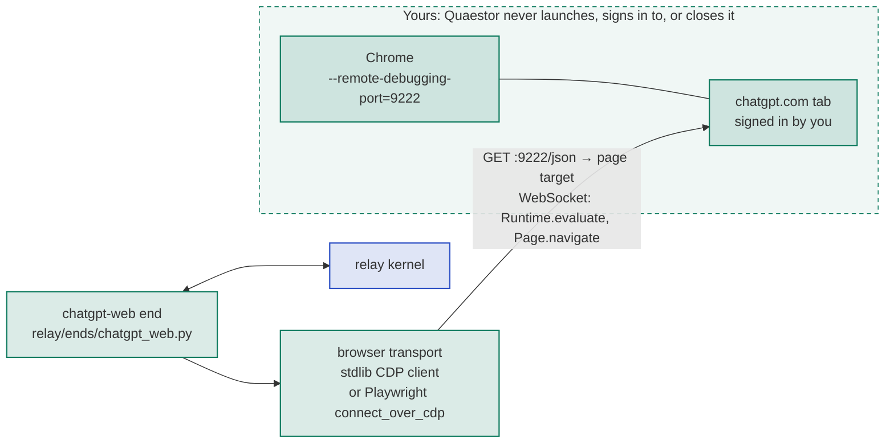

`CdpTransport.attach` reads the debug endpoint's target list, keeps targets of type `page`,
prefers the one whose URL matches ChatGPT, and opens its `webSocketDebuggerUrl` with the
package's own RFC 6455 client. Every CSS selector the end relies on lives in one table,
[`executors/chatgpt_web_page.SELECTORS`](src/quaestor/executors/chatgpt_web_page.py). That's
the first place to look when ChatGPT ships a redesign:

```text
composer   #prompt-textarea · textarea[data-id] · div[contenteditable='true']
send       [data-testid='send-button'] · button[aria-label*='Send']
stop       [data-testid='stop-button'] · button[aria-label*='Stop']
assistant  [data-message-author-role='assistant']
turn       [data-message-author-role]          id   [data-message-id]
```

### The connector path: ChatGPT reads Quaestor over a tunnel

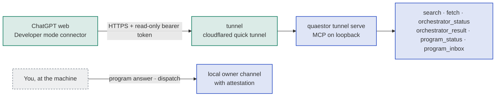

```bash
quaestor tunnel serve --repo myrepo="/path/to/your/project"   # prints connector_url + a one-time token
quaestor tunnel doctor --url https://<host>.trycloudflare.com --token tok_...
quaestor tunnel revoke                                         # every tunnel request fails auth from here
```

> [!TIP]
> **The ceiling is a token, not a promise.** The remote caller's surface comes from *which secret
> authenticated*, never from a header or an argument. The write-capable loopback token never
> leaves the machine, so a remote caller has nothing it could present to widen its surface.
> Attempts come back `REMOTE_READ_ONLY` and are logged. Setup and limits:
> [`docs/CHATGPT-PLUS.md`](docs/CHATGPT-PLUS.md).

## One relay exchange, start to finish

<picture>
  <source media="(prefers-color-scheme: dark)" srcset="docs/assets/exchange-dark.svg">
  
</picture>

The same exchange as a sequence, with each side's lane tinted:

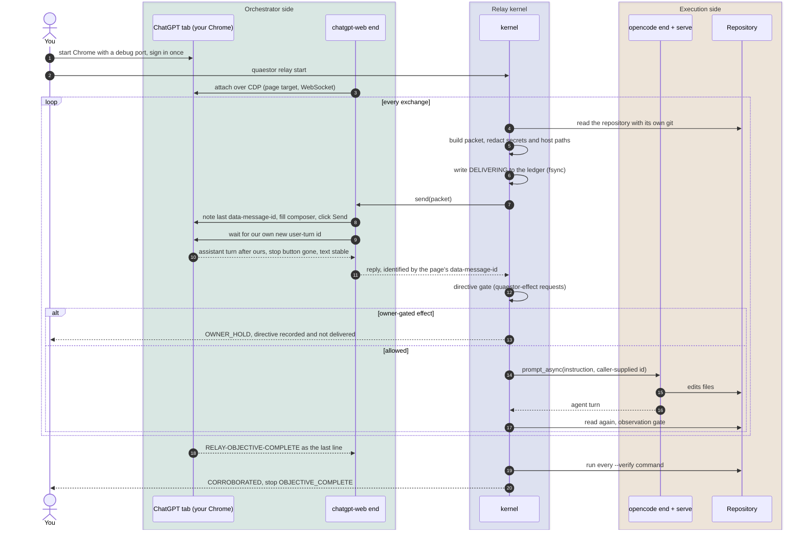

<details>
<summary><b>Each step in detail</b></summary>

1. **You start a browser Quaestor can attach to, and sign in once.** Quaestor never launches the
   browser, never sees the password and never closes the window.
2. **The end finds the right tab.** It reads `http://127.0.0.1:9222/json`, picks the ChatGPT page
   target and opens its DevTools WebSocket.
3. **The kernel builds the packet.** On the first turn ChatGPT gets a charter: who it is, who the
   agent is, and what the relay will and won't do. After every agent turn it gets a bounded
   packet:

   ```text
   [relay exchange 6 | execution session ses_faf7ae…]

   --- WHAT THE AGENT SAID ---
   …the agent's turn, verbatim, up to a stated cap…

   --- WHAT THE REPOSITORY SHOWS ---
   Repository observed independently: working-tree entries now dirty: report.py, test_ledger.py.

   Reply with your next instruction for the agent, or with RELAY-OBJECTIVE-COMPLETE …
   ```

   Everything crossing the relay, in both directions, passes `core.classification` first. It
   replaces credential- and host-path-shaped spans with visible markers
   (`<secret-withheld:openai_key>`, `<path-withheld>`) and leaves the engineering prose intact.
4. **Record first.** A `DELIVERING` row is written and fsynced *before* the submit. If the process
   dies between the send and the acknowledgement, that row is the evidence that a send may have
   happened.
5. **`send()`** records the last assistant message's `data-message-id` (with the assistant count
   as a fallback) in the receipt's `native_id`, and the kernel persists it. The end then fills the
   composer and clicks Send through page JavaScript run with `Runtime.evaluate`. Finally it waits
   for a user-turn id that *differs* from the one present before the submit, so a slow render
   can't anchor the exchange to somebody else's message.
6. **`receive()`** takes the assistant turn that follows *our* user turn, once it has really
   finished. The page must still be the conversation the message went to, or the end refuses with
   `END_WORKSPACE_MISMATCH`. A reply counts only once the stop affordance is gone and the text has
   stopped changing, and a partial reply is never forwarded.
7. **The directive gate** reads the reply. Editing files is the default; anything more needs a
   fenced `quaestor-effect` block, and a request isn't a grant.
8. **The instruction goes to the agent verbatim**, with a small identity header and, on the first
   turn, a note that its reply is relayed back automatically. It's sent with `prompt_async` under
   a **caller-supplied message id**, so the agent keeps working even if the relay dies.
9. **The kernel reads the repository again, independently.** If the difference implies a
   capability the profile doesn't carry, the relay holds. Otherwise the loop returns to step 3.
10. **"Done" is a claim, and it gets measured.** See [below](#done-is-a-claim-and-it-gets-measured).

</details>

## Reading a chat page reliably

<picture>
  <source media="(prefers-color-scheme: dark)" srcset="docs/assets/page-identity-dark.svg">
  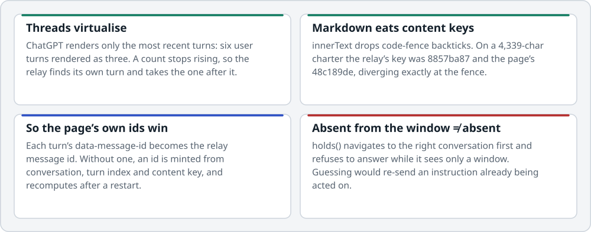
</picture>

The rendered page isn't a transcript. Both matchers built from rendered text failed against the
real page, so identity comes from the vendor's own ids wherever they exist, and
`provenance.anchored_by` records which guarantee actually held (`user_turn_id` or
`user_turn_content_key`). Two more rules follow from the same lesson:

- **The anchor survives a restart.** The pre-submit anchor travels through the durable ledger,
  so a restarted relay asks the same "newer than what?" question the dead one was asking. An
  in-memory counter would reset to zero and re-read the previous answer as new.
- **A stream that dies mid-token looks finished.** It loses its stop button and stops changing,
  so it satisfies every completion check *better* than a healthy one. A refusal ledger means a
  turn already judged incomplete is accepted only if its text genuinely moved on.

## Governance: gate the act, not the sentence

<picture>
  <source media="(prefers-color-scheme: dark)" srcset="docs/assets/gates-dark.svg">
  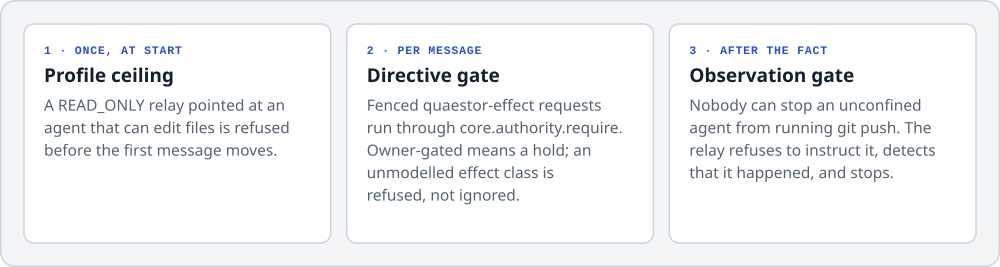
</picture>

> [!IMPORTANT]
> **Prose moves nothing.** A model can't widen its own envelope by choosing a sentence: "I
> authorise this" or "you may now push" isn't the channel. Authority comes from two places a
> model can't write: the **authority profile** the relay was started under, and a live **owner
> grant** corroborated by an authenticated owner channel.

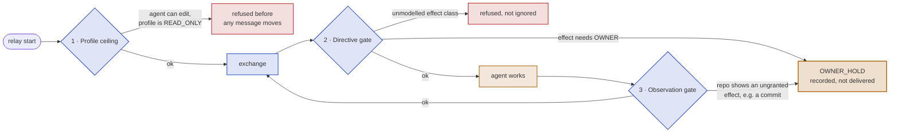

An Orchestrator that genuinely needs more than file edits asks for it in a fenced block:

````text
```quaestor-effect
effect: GIT_COMMIT
```
````

The request is mapped onto capabilities and run through `core.authority.require`. Resuming after
a hold re-evaluates the gate against current authority, so resuming isn't the same as approving.
And **a gate never fires before the turn that triggered it is durable**, so you can always read
the work that produced the effect.

## "Done" is a claim, and it gets measured

`RELAY-OBJECTIVE-COMPLETE` used to stop the relay by itself. That put the model in charge of
grading its own homework, and a live run proved the risk: the Orchestrator declared the objective
met while the fixture's own suite was still failing. Now the marker counts only when it's the
**last line** of the turn, and each `--verify` command is run **by the relay, in this process, in
the authorised project**.

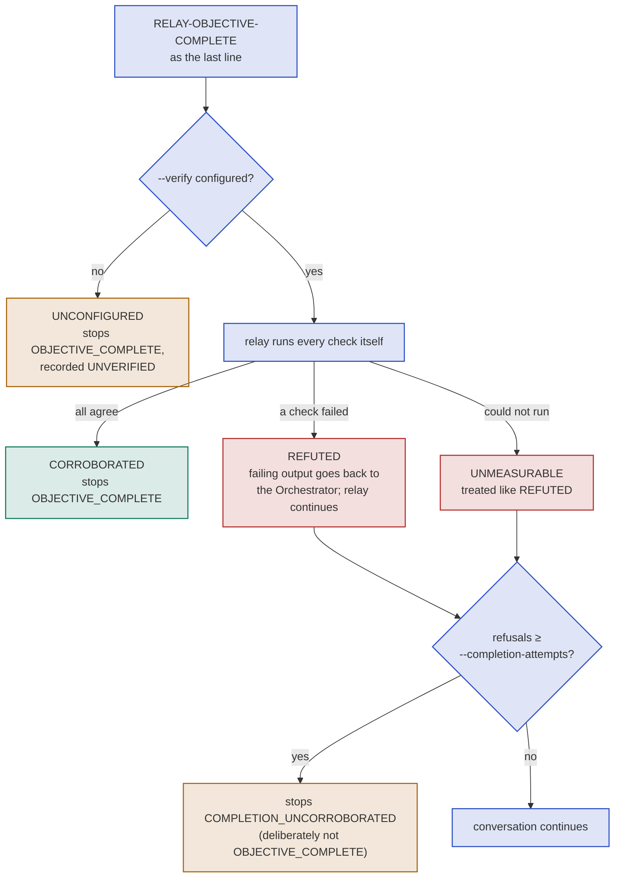

| Verdict | Relay | Meaning |
|---|---|---|
| `CORROBORATED` | stops `OBJECTIVE_COMPLETE` | Every check ran and agreed with the claim. |
| `UNCONFIGURED` | stops `OBJECTIVE_COMPLETE` | Nothing was configured to measure the claim, so it's recorded **UNVERIFIED**: an honest label, not a passing one. |
| `REFUTED` | continues | A check disagreed. Its output rides back to the Orchestrator as a blocker. |
| `UNMEASURABLE` | continues | A check couldn't run at all. Never read as passing. |

The refusal count is read from the durable event log, so a relay can't forget its refusals by
crashing. A passing suite still isn't proof the *right* work was done: corroboration answers "do
the project's own checks agree?", never "was this the correct objective?".

<details>
<summary><b>One bad turn isn't a dead endpoint, and "the endpoint is fine" isn't "the model works"</b></summary>

**Incomplete turns.** When a turn arrives incomplete, the relay asks the endpoint whether it's
still usable and re-asks up to `--incomplete-retries` times. Only the *receive* is retried, never
the send. A retry re-asks rather than resuming mid-sentence, and the partial is never forwarded.
Exhaustion stops as `EXECUTION_INCOMPLETE` / `ORCHESTRATOR_INCOMPLETE`, which is distinct from
`*_DISCONNECTED`.

**Model probes.** `relay doctor` and `relay start` also probe each endpoint with one real turn,
answering `PROBE_OK`, `PROBE_UPSTREAM_FAILED`, `PROBE_REFUSED` or `PROBE_UNSUPPORTED`. A gateway
returning HTTP 503 to every request, or a model that errors on every inference, both looked
healthy to a status check; the probe is what tells them apart. ChatGPT Web deliberately answers
`PROBE_UNSUPPORTED`: the only place to probe it is your own thread, and a probe that posts into
the conversation it protects costs more than it measures.

</details>

## Surviving a crash mid-turn

Two durable facts are written **before** the thing they describe: `DELIVERING` before the send,
and `awaiting_message_id` before the wait. A relay spends nearly all its wall-clock time waiting
for a slow agent, which is where a kill usually lands. On `quaestor relay resume`, both ends
re-attach to the identities the record names, and every delivery that was in flight is
reconciled:

<picture>
  <source media="(prefers-color-scheme: dark)" srcset="docs/assets/recovery-dark.svg">
  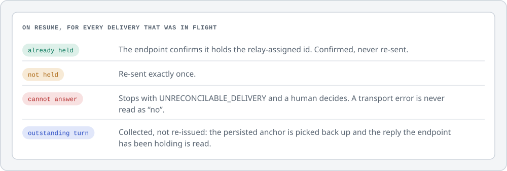
</picture>

This works for OpenCode because `prompt_async` accepts a caller-supplied message id, so
reconciliation is a lookup rather than an inference. For ChatGPT, `holds()` matches on the id the
page gave our user turn. An endpoint that can't answer "do you already hold this?" doesn't define
`holds` at all, and the kernel stops instead of guessing. An endpoint that can't resume answers
`RESUME_UNSUPPORTED`, and that's recorded as such: continuity the transport doesn't provide is
never fabricated.

## Quick start: Program Mode

Program Mode ships **inert by default**. Until a deployment selects otherwise, execution mode is
`QUALIFICATION_ONLY`: the full admission ladder runs and writes durable records, but no executor
is constructed.

```bash
# 1. A deployment home. Durable state lives HERE, never inside any repository.
mkdir -p /path/to/home
quaestor --home /path/to/home mode set LOCAL_GOVERNED   # a deliberate, local act
quaestor --home /path/to/home preflight --write         # subscription auth must be provable

# 2. A project manifest next to the target repository. Defaults are restrictive.
quaestor init --path /path/to/your/project              # writes quaestor.yaml for review
#    edit quaestor.yaml: executor.default: claude-cli, commands.test, security.protected_roots
#    NOTE: the product writes YAML manifests. A hand-written quaestor.toml is accepted as
#    input (discovery prefers it) but the product does not write or edit TOML yet.

# 3. One objective -> lanes -> governed ticks.
quaestor --home /path/to/home program create --title "Add export endpoint" \
    --objective "Implement CSV export behind the feature flag." \
    --project /path/to/your/project --acceptance "export tests pass"
quaestor --home /path/to/home program plan <program_id> --title "main" \
    --task "Implement CSV export." --kind implementation
quaestor --home /path/to/home program serve <program_id>     # the hands-off tick loop
quaestor --home /path/to/home program inbox <program_id>     # what paused for a decision
quaestor --home /path/to/home program answer <program_id> <message_id> --text "..." --authority OWNER

# 4. When every lane completes, integration merges locally and verifies the union.
quaestor --home /path/to/home program status <program_id>   # CANDIDATE_PASS or CANDIDATE_FAIL
```

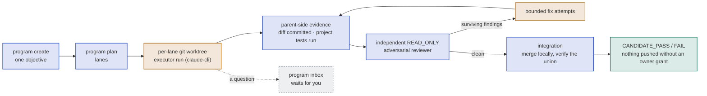

Two worked manifests ship in [`examples/`](examples/): a synthetic fixture and a reference
integration. Both consume the platform **without any change to the core**, which is the
genericity acceptance test, enforced by a control. The full operator reference (home layout,
modes, credentials, reconciliation, troubleshooting) is
[`docs/OPERATIONS.md`](docs/OPERATIONS.md).

## Architecture

```text
relay/        kernel, ends          persistent Orchestrator <-> Execution Agent relay
transports/   MCP, CLI, tunnel      speak to Orchestrators; own NO orchestration semantics
review/       standard, adversarial judge results; never grade their own work
executors/    claude_code, chatgpt_web, openrouter, fake
                                    run bounded work; provider detail stops here
adapters/     universal agent-end   assurance MEASURED by probes, never self-declared
sandbox/      docker                confinement providers
workspace/    git worktree          isolated working copies
evidence/     independent measurement
secrets/      credential providers
projects/     per-project config and adapters
    └──────►  core/    state · identity · authority · dispatch · lanes · messages · decisions
```

`core` imports **nothing** from the layers above it. A core that statically depends on one
executor can't be used with another, which would make "model-agnostic" a slogan, so control
`171` walks the real import graph to prove the rule.

**Capability isn't assurance.** Relay endpoints report what they *do* separately from what this
build can *prove*. Assurance is computed from the proof facts along the ladder
`OBSERVED < DIALOGUE < MANAGED < GOVERNED < CONFINED`, and is never self-declared:

| OpenCode endpoint | Value | Why |
|---|---|---|
| `can_mutate_repo` | yes | It really does edit files. |
| `proves_workspace_identity` | yes | The server agrees which worktree this is. |
| `proves_confinement` | **no** | It runs on the host with your permissions. |
| **computed assurance** | **`DIALOGUE`** | A weak proof lowers assurance; it doesn't erase a real capability. |

Boundaries, actors, the two-way protocol and lanes are in
[`docs/ARCHITECTURE.md`](docs/ARCHITECTURE.md).

<a id="status"></a>
## Status and evidence

<picture>
  <source media="(prefers-color-scheme: dark)" srcset="docs/assets/maturity-dark.svg">
  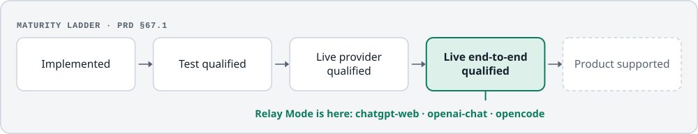
</picture>

| Endpoint | Kind | Maturity |
|---|---|---|
| Orchestrator | `openai-chat`: any OpenAI-compatible chat-completions endpoint (OpenRouter, OpenCode Zen, OpenAI, a local gateway) | `LIVE_END_TO_END_QUALIFIED` |
| Orchestrator | `chatgpt-web`: one conversation in a browser you started and signed into, driven over CDP | `LIVE_END_TO_END_QUALIFIED` |
| Execution | `opencode`: attaches to a running `opencode serve` and an existing or resumable session | `LIVE_END_TO_END_QUALIFIED` |
| Both | `fake`: scripted; proves kernel mechanics and is **refused by `relay start`** | `TEST_QUALIFIED` |

Not yet relay endpoints: Claude Code and Codex existing-session attachment, and the
file-inbox/command bridges. Claude Code runs today as a Program Mode executor, `claude-cli`.
**Nothing is `PRODUCT_SUPPORTED`**: there's no installer, Quaestor Core service, browser
extension, native messaging host or signed distribution.

### The ChatGPT Web qualification run

<picture>
  <source media="(prefers-color-scheme: dark)" srcset="docs/assets/qualification-dark.svg">
  
</picture>

The run used a real signed-in ChatGPT browser (transport `cdp`, stdlib only), a real
`opencode serve` session and a real fixture repository, on the code as it shipped after
adversarial review. The slice stopped at `MAX_EXCHANGES_REACHED` with a configured ceiling of 30,
so it ran out of budget, not health.

Earlier records cover the `openai-chat` Orchestrator (19 delivered messages, 7 failing tests to 8
passing, recovery across a kill, and an owner hold with 0 messages reaching the agent) and
completion corroboration (the first claim `REFUTED` against an untouched repository, the second
`CORROBORATED`). All of them, including superseded runs and their caveats, are in
[`docs/RELAY-MODE.md`](docs/RELAY-MODE.md#live-qualification).

> [!NOTE]
> Evidence files are written to `var/relay-qualification/` by the opt-in live harness
> (`QUAESTOR_RELAY_LIVE=1 python -m tests.relay_live_harness`). `var/` isn't committed, so a
> fresh clone doesn't contain them; the harness reproduces them against your own browser, agent
> server and provider.

**How to measure the rest.** `python run_tests.py` is the gate and the only honest source for
test and control counts. It enforces three floors that a green `unittest` run can't satisfy on
its own: a minimum test count, every expected module imported and contributing tests, and every
required control both declared and executed. It prints a JSON report, writes it to
`var/last-test-report.json`, and exits 0 only on `PASS`. Unit controls prove the kernel's
mechanics; they aren't evidence that Relay Mode works against real providers, which is what the
live harness is for.

**Program Mode.** In `LOCAL_GOVERNED` mode, real executor dispatch is proven live. Detached workers
run `claude-cli` under `READ_ONLY`/`STANDARD_EDIT` envelopes in per-lane worktrees, with
independent evidence, adversarial review cycles and bounded fix attempts, and multi-lane programs
have completed end to end through integration. Everything above `STANDARD_EDIT` stays
owner-gated.

## Security and known limits

The properties under automated test, and what's deliberately *not* defended, are in
[`SECURITY.md`](SECURITY.md) and [`docs/THREAT-MODEL.md`](docs/THREAT-MODEL.md).

> [!CAUTION]
> **The execution agent is unconfined.** It runs on the host with your permissions (computed
> assurance `DIALOGUE`), and its tool permissions are its own configuration, not something the
> relay enforces. Quaestor detects and stops on effects it observes; it doesn't claim to prevent
> them.

| Limit | What it means |
|---|---|
| **The debug port authenticates nobody** | Any local process that can reach `:9222` drives that browser as you. Loopback-only limits exposure to local processes but doesn't remove it. |
| **It will break when the page changes** | ChatGPT is a third party's product, redesigned without notice. Every selector lives in `executors/chatgpt_web_page.SELECTORS`. |
| **No origin check on the bound tab** | The browser end binds to the visible tab. Tracked, not fixed. |
| **No bot-detection evasion** | No fingerprint or user-agent changes, no CAPTCHA handling, no proxy rotation, and a control asserts all of that is absent. Whether automating a chat product fits your provider's terms is your call. |
| **Not a second opinion on GPT work** | `chatgpt-web` is family `openai`, so it collides with `codex-cli` in the pairing check: one vendor reviewing itself. |
| **Redaction is depth, not the boundary** | It's a pattern classifier, so a novel secret format will pass. The boundary is that the relay never routes a credential through prose. |
| **One relay, one conversation** | Deliberate serialisation: it's what keeps duplicate-delivery reasoning tractable. |
| **Local-first means local trust** | Quaestor doesn't protect against a compromised host. |

## Documentation

| Document | What it covers |
|---|---|
| [`docs/PRD.md`](docs/PRD.md) | **The canonical product contract.** It governs; every other document is implementation record or history. |
| [`docs/RELAY-MODE.md`](docs/RELAY-MODE.md) | Relay Mode: endpoints, governance gates, recovery, and every live qualification record |
| [`docs/CHATGPT-PLUS.md`](docs/CHATGPT-PLUS.md) | The ChatGPT paths specifically: the Plus-account MCP tunnel and the browser-driven `chatgpt-web` surfaces |
| [`docs/OPERATIONS.md`](docs/OPERATIONS.md) | Installing, deploying and operating: modes, credentials, programs, troubleshooting |
| [`docs/ARCHITECTURE.md`](docs/ARCHITECTURE.md) | Boundaries, actors, the two-way protocol, lanes |
| [`docs/THREAT-MODEL.md`](docs/THREAT-MODEL.md) | What it defends against, and what it doesn't |
| [`docs/QUALIFICATION.md`](docs/QUALIFICATION.md) | The adversarial qualification record: what was claimed, what an independent pass found, what the tree does now |
| [`docs/EXTRACTION.md`](docs/EXTRACTION.md) | How the platform was extracted, and what's deferred |
| [`docs/DESIGN-PROVENANCE.md`](docs/DESIGN-PROVENANCE.md) | Every externally studied system: what was inspected, under what licence, what was adopted and rejected |
| [`docs/CONTRIBUTING.md`](docs/CONTRIBUTING.md) | How to add a provider, relay end or transport, and the rules for controls |

## Contributing

Read [`docs/CONTRIBUTING.md`](docs/CONTRIBUTING.md) first. The short version:

- **Standard library only.** A framework added to look sophisticated is supply-chain surface
  bought for nothing. Decode subprocess output as UTF-8 explicitly; never use `text=True`.
- **`python run_tests.py` must pass** and `python check_static.py` must be clean. The gate fails
  a run that inspected nothing.
- **A control must mutate something or assert a refusal**, must emit an inspection count, and
  must be registered in [`tests/controls.py`](tests/controls.py). The gate fails if a required
  control is undeclared or never executed.
- **`core/` imports nothing above it.** New providers go through the registries
  (`executors/registry.py`, `relay/registry.py`).
- **The README's illustrations are generated.** Edit
  [`docs/assets/render_readme_art.py`](docs/assets/render_readme_art.py) and run it; don't
  hand-edit the SVGs.
- **By submitting a contribution you agree it may be distributed under both the PolyForm
  Noncommercial licence and the project's commercial licences** (see
  [`COMMERCIAL-LICENSE.md`](COMMERCIAL-LICENSE.md#contributions)).

CI runs a fast pure-suite job plus the full suite on Python 3.12 and 3.13 on GitHub-hosted Linux
runners ([`.github/workflows/ci.yml`](.github/workflows/ci.yml)). The required-check policy is in
[`.github/CHECKS-POLICY.md`](.github/CHECKS-POLICY.md).

## Security reporting

Please don't open a public issue for a vulnerability. Use GitHub's **private vulnerability
reporting** (the repository's *Security* tab → *Report a vulnerability*). What the platform
defends, and what it doesn't, is in [`SECURITY.md`](SECURITY.md).

## Licence

Quaestor is **source-available** under the [PolyForm Noncommercial License
1.0.0](LICENSE.md). It isn't open source.

| | |
|---|---|
| **Free** | Non-commercial use: research, experiments, personal study and hobby projects, and use by charities, educational institutions, public research organisations and government. Keep the `Required Notice:` line from [`LICENSE.md`](LICENSE.md) with any copy you share, and please cite it in published research ([`CITATION.cff`](CITATION.cff)). |
| **Paid** | Commercial use, including internal use inside a company. See [`COMMERCIAL-LICENSE.md`](COMMERCIAL-LICENSE.md) for what counts and how to get a licence. |
